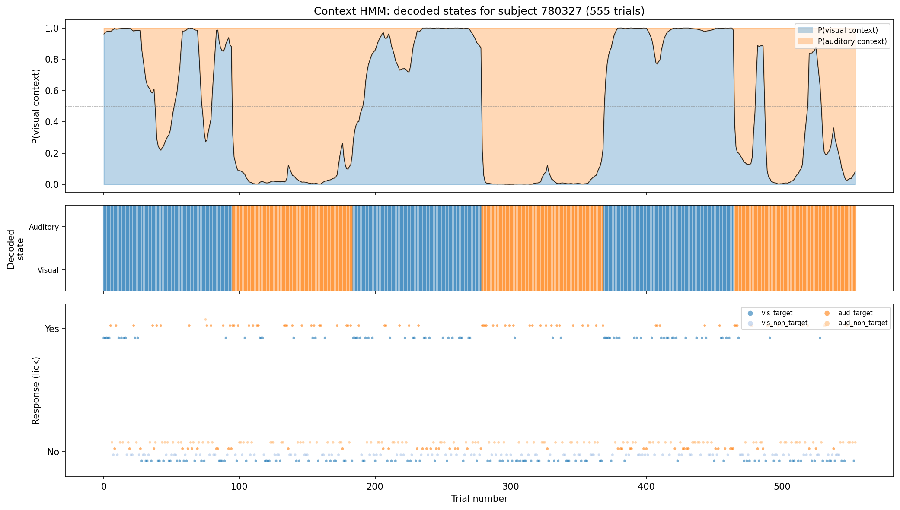

# Context-Aware HMM Results

## Model specification

- **Hidden states**: 2 (visual-rewarded context, auditory-rewarded context)
- **Parameters**: 9 (1 transition + 8 emission)
- **Training data**: 60,538 trials from 113 subjects
- **Test data**: 60,507 trials from 113 subjects

## Fitted parameters

### Switch probability

`p_switch = 0.018822`

Expected block length: 53.1 trials (= 1 / p_switch)

### Transition matrix

| | Visual context | Auditory context |
|---|---|---|
| **Visual context** | 0.981178 | 0.018822 |
| **Auditory context** | 0.018822 | 0.981178 |

### Response probabilities: P(lick | state, stimulus)

| Stimulus | Visual context (State 0) | Auditory context (State 1) |
|---|---|---|
| vis_target | 0.6846 | 0.4027 |
| vis_non_target | 0.0360 | 0.0380 |
| aud_target | 0.2487 | 0.9842 |
| aud_non_target | 0.0205 | 0.2323 |

## Per-state response profiles

**Visual-rewarded context (State 0):**
- Responds to visual targets at rate 0.6846
- Responds to auditory targets at rate 0.2487
- Visual non-target false alarm rate: 0.0360
- Auditory non-target false alarm rate: 0.0205

**Auditory-rewarded context (State 1):**
- Responds to auditory targets at rate 0.9842
- Responds to visual targets at rate 0.4027
- Visual non-target false alarm rate: 0.0380
- Auditory non-target false alarm rate: 0.2323

## Training-set evaluation

| Metric | Value |
|---|---|
| Accuracy | 0.8210 |
| Balanced accuracy | 0.7904 |
| AUC-ROC | 0.9160 |
| Log-loss | 0.3731 |

## Test-set evaluation

| Metric | Value |
|---|---|
| Accuracy | 0.8250 |
| Balanced accuracy | 0.7932 |
| AUC-ROC | 0.9168 |
| Log-loss | 0.3696 |

## Example subject: decoded context states

The figure shows the posterior probability of the visual-rewarded context (top),
the Viterbi-decoded state sequence (middle), and trial-by-trial responses colored
by stimulus type (bottom) for the training subject with the most trials. Transitions
between blue (visual context) and orange (auditory context) regions correspond to
the model's inferred block switches.

## Interpretation

This 2-state context HMM explicitly models the key latent variable in the
context-switching task: which modality is currently rewarded. Unlike the standard
HMM (which discovered 4 states corresponding to the 4 stimulus types), this model
uses stimulus identity as an observed covariate and infers the hidden reward context
from the pattern of responses.

The fitted switch probability of 0.0188 implies an expected block length
of ~53 trials, which is consistent with the experimental design
(~80-100 trials per block).

The response probability matrix reveals the key behavioral signature: mice respond
at higher rates to the target stimulus of the currently rewarded modality and at
lower rates to the non-rewarded target, with low false alarm rates to non-targets
in both contexts.
