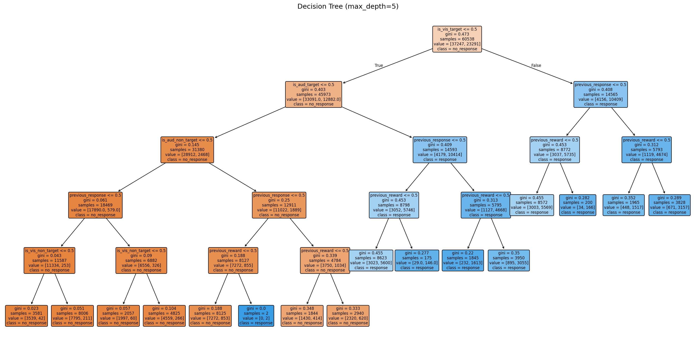

# Decision Tree -- Results

## Cross-Validation (max_depth selection)

5-fold cross-validation on the training set using balanced accuracy.

| max_depth | balanced_accuracy |
|---|---|
| 2 | 0.8351 |
| 3 | 0.8351 |
| 4 | 0.8351 |
| 5 | 0.8352 | *
| 6 | 0.8352 |
| 8 | 0.8352 |
| 10 | 0.8352 |
| None | 0.8352 |

Best max_depth: **5**

## Test Set Metrics

| Metric | Value |
|---|---|
| Accuracy | 0.8168 |
| Balanced accuracy | 0.8335 |
| AUC-ROC | 0.8733 |
| Log-loss | 0.4131 |

## Confusion Matrix

|  | Predicted 0 | Predicted 1 |
|---|---|---|
| Actual 0 | 29,111 | 8,810 |
| Actual 1 | 2,276 | 20,310 |

## Feature Importances

| Feature | Importance |
|---|---|
| is_aud_target | 0.6237 |
| is_vis_target | 0.3242 |
| previous_response | 0.0315 |
| is_aud_non_target | 0.0156 |
| previous_reward | 0.0047 |
| is_vis_non_target | 0.0002 |

## Decision Rules

```
|--- is_vis_target <= 0.50
|   |--- is_aud_target <= 0.50
|   |   |--- is_aud_non_target <= 0.50
|   |   |   |--- previous_response <= 0.50
|   |   |   |   |--- is_vis_non_target <= 0.50
|   |   |   |   |   |--- class: 0
|   |   |   |   |--- is_vis_non_target >  0.50
|   |   |   |   |   |--- class: 0
|   |   |   |--- previous_response >  0.50
|   |   |   |   |--- is_vis_non_target <= 0.50
|   |   |   |   |   |--- class: 0
|   |   |   |   |--- is_vis_non_target >  0.50
|   |   |   |   |   |--- class: 0
|   |   |--- is_aud_non_target >  0.50
|   |   |   |--- previous_response <= 0.50
|   |   |   |   |--- previous_reward <= 0.50
|   |   |   |   |   |--- class: 0
|   |   |   |   |--- previous_reward >  0.50
|   |   |   |   |   |--- class: 1
|   |   |   |--- previous_response >  0.50
|   |   |   |   |--- previous_reward <= 0.50
|   |   |   |   |   |--- class: 0
|   |   |   |   |--- previous_reward >  0.50
|   |   |   |   |   |--- class: 0
|   |--- is_aud_target >  0.50
|   |   |--- previous_response <= 0.50
|   |   |   |--- previous_reward <= 0.50
|   |   |   |   |--- class: 1
|   |   |   |--- previous_reward >  0.50
|   |   |   |   |--- class: 1
|   |   |--- previous_response >  0.50
|   |   |   |--- previous_reward <= 0.50
|   |   |   |   |--- class: 1
|   |   |   |--- previous_reward >  0.50
|   |   |   |   |--- class: 1
|--- is_vis_target >  0.50
|   |--- previous_response <= 0.50
|   |   |--- previous_reward <= 0.50
|   |   |   |--- class: 1
|   |   |--- previous_reward >  0.50
|   |   |   |--- class: 1
|   |--- previous_response >  0.50
|   |   |--- previous_reward <= 0.50
|   |   |   |--- class: 1
|   |   |--- previous_reward >  0.50
|   |   |   |--- class: 1
```

## Tree Visualization


